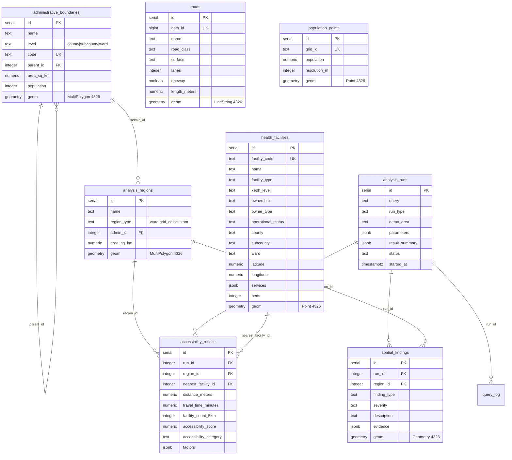

# GeoMind AI — Database Schema Documentation

> **Database:** PostgreSQL 16 + PostGIS 3.4  
> **SRID:** 4326 (WGS 84) throughout  
> **Demo Area:** Nairobi County, Kenya

---

## Entity Relationship Diagram

---

## Tables Summary

| # | Table | Purpose | Geometry | Records (est.) |
|---|---|---|---|---|
| 1 | `administrative_boundaries` | County/subcounty/ward polygons | MultiPolygon | ~100 |
| 2 | `health_facilities` | KMHFR facility locations | Point | ~1,000–1,500 |
| 3 | `roads` | OSM road network | LineString | ~50,000–100,000 |
| 4 | `population_points` | WorldPop grid centroids | Point | ~10,000+ |
| 5 | `settlements` | Named places (optional) | Point | varies |
| 6 | `analysis_regions` | Analysis units (wards/grid) | MultiPolygon | ~85 |
| 7 | `analysis_runs` | Analysis execution tracking | — | per-query |
| 8 | `accessibility_results` | Scores per region per run | — | ~85/run |
| 9 | `spatial_findings` | AI evidence/insights | Geometry | varies |
| 10 | `satellite_imagery` | Sentinel-2 metadata | Polygon (bbox) | ~5–10 |
| 11 | `query_log` | NL query audit trail | — | per-query |

---

## Views

| View | Purpose |
|---|---|
| `v_facility_count_by_ward` | Facility counts/types per ward with population |
| `v_accessibility_geojson` | Accessibility results joined with region geometries |

## Functions

| Function | Returns | Purpose |
|---|---|---|
| `fn_accessibility_geojson(run_id)` | JSONB | Full GeoJSON FeatureCollection of accessibility results |
| `fn_facilities_geojson(county, type)` | JSONB | GeoJSON FeatureCollection of health facilities |
| `fn_region_accessibility(geom)` | TABLE | Nearest facility + counts for any input geometry |

---

## Spatial Indexes

All geometry columns have GiST spatial indexes. Key indexes:

| Index | Table | Column | Type |
|---|---|---|---|
| `idx_admin_geom` | administrative_boundaries | geom | GIST |
| `idx_hf_geom` | health_facilities | geom | GIST |
| `idx_roads_geom` | roads | geom | GIST |
| `idx_pop_geom` | population_points | geom | GIST |
| `idx_ar_geom` | analysis_regions | geom | GIST |
| `idx_findings_geom` | spatial_findings | geom | GIST |
| `idx_sat_bbox` | satellite_imagery | bbox | GIST |

Additional attribute indexes on frequently filtered columns (facility_type, road_class, level, etc.) — see [02_schema.sql](file:///c:/Users/mutwi/OneDrive/Documents/GeoMind-database/database/init/02_schema.sql) for full list.

---

## Accessibility Category Scale

| Category | Score | Distance to Nearest Facility |
|---|---|---|
| `excellent` | 80–100 | < 1 km |
| `good` | 60–79 | 1–3 km |
| `moderate` | 40–59 | 3–5 km |
| `limited` | 20–39 | 5–10 km |
| `critical` | 0–19 | > 10 km |
